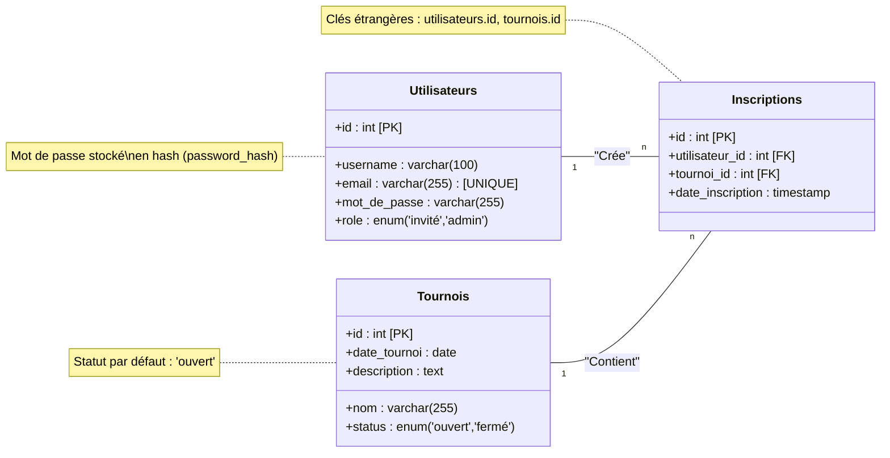

# ArrasGame

## Accès à l'application
- Lien du site déployé : [ArrasGame](https://lux.enzo.worldlite.fr/ArrasGame/index.php)
- Compte de test :
  - Admin : admin / admin1234
  - Utilisateurs : guest / guest1234

## Introduction
ArrasGame est une plateforme web conçue pour organiser des tournois de jeux vidéo entre amis ou en compétition. Ce projet s'adresse aux joueurs occasionnels, aux clubs de gaming, et aux organisateurs de compétitions.

### Technologies utilisées
- **Backend** : PHP 8.2 (PDO), MySQL 8.0
- **Frontend** : Bootstrap 5.3, jQuery 3.6
- **API** : PHP natif (RESTful)
- **Outils** : Docker, Composer

## Installation

### Prérequis
- **PHP** : Version 8.0 ou supérieure.
- **MySQL** : Version 5.7 ou supérieure.
- **Serveur Web** : Apache ou Nginx.
- **Composer** (optionnel) : Pour gérer les dépendances PHP.

### Étapes d'installation
1. Clonez le dépôt :
   ```bash
   git clone https://github.com/eLux-info/AP1/tree/main
   ```
2. Placez le projet dans le répertoire de votre serveur local (ex. : `c:\laragon\www\ArrasGame`).
3. Configurez la base de données :
   - Créez une base de données nommée `ArrasGame`.
   - Importez le fichier SQL contenu dans `/database.`
4. Configurez la connexion à la base de données dans `connexion.php` :
   ```php
   $host = '127.0.0.1';
   $dbname = 'ArrasGame';
   $username = 'UtilisateurPHPmyAdmin';
   $password = 'MotDePassePHPmyAdmin';
   ```
5. Assurez-vous que les permissions des dossiers sont correctes :
   ```bash
   chmod -R 755 /var/www/ArrasGame
   ```
6. Lancez votre serveur local (ex. : Laragon, XAMPP) et accédez au site via `http://localhost/ArrasGame`.

### Configuration avancée
- Si vous utilisez Docker, voici un exemple de configuration :
   ```yaml
   version: '3.8'
   services:
     web:
       image: php:8.0-apache
       volumes:
         - ./ArrasGame:/var/www/html
       ports:
         - "8080:80"
       depends_on:
         - db
     db:
       image: mysql:5.7
       environment:
         MYSQL_ROOT_PASSWORD: root
         MYSQL_DATABASE: ArrasGame
   ```

## Structure du projet

### Arborescence
```
├── css/
│   ├── bootstrap.css
│   ├── responsive.css
│   └── ...
├── fonts/
│   └── AndaleMono.ttf
├── images/
│   ├── call.png
│   ├── console.png
│   └── ...
├── js/
│   ├── bootstrap.js
│   ├── custom.js
│   └── ...
├── connexion.php
├── create_inscription.php
├── ...
├── index.php
├── tournois.php
└── README.md
```


### Fichiers critiques
- **connexion.php** : Gère la connexion à la base de données.
- **index.php** : Page d'accueil du site.
- **tournois.php** : Affiche la liste des tournois et les inscriptions.

## Fonctionnalités principales

### Utilisateurs
- Inscription et connexion sécurisées.
- Inscription à des tournois ouverts.
- Désinscription des tournois auxquels ils participent.

### Administrateurs
- Gestion des utilisateurs : création, modification et suppression.
- Gestion des tournois : création, modification et suppression.
- Gestion des inscriptions : création, modification et suppression.

### Cas d'usage
1. Un utilisateur s'inscrit sur la plateforme.
2. Il se connecte et choisit un tournoi auquel participer.
3. L'administrateur peut gérer les inscriptions et les tournois.

## API

### Endpoints principaux
| Endpoint                  | Méthode | Paramètres              |
|---------------------------|---------|-------------------------|
| `/register2.php`          | POST    | `username`, `email`, `password` |
| `/login.php`              | POST    | `username`, `password`  |
| `/register_tournament.php`| POST    | `tournoi_id`            |

### Authentification
Les sessions PHP sont utilisées pour gérer l'authentification des utilisateurs. Les informations de session incluent l'ID utilisateur, le nom d'utilisateur et le rôle.

## Sécurité
- **Hashage des mots de passe** : Utilisation de `password_hash` pour sécuriser les mots de passe.
- **Requêtes préparées** : Protection contre les injections SQL.

## Dépendances
- **PHP** : Langage principal pour le backend.
- **MySQL** : Base de données pour stocker les utilisateurs, tournois et inscriptions.
- **Bootstrap 5.3** : Framework CSS pour le design.
- **jQuery 3.6** : Bibliothèque JavaScript pour les interactions.

## Licence
Ce projet est sous licence [MIT](https://opensource.org/licenses/MIT).
